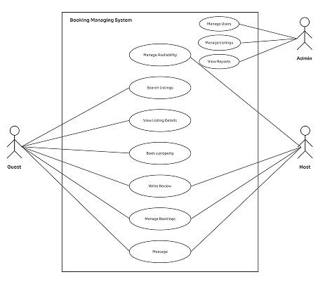

# Requirement Analysis in Software Development.

## Introduction
This is the documentation about Requirement Analysis in Software Development

## What is Requirement Analysis?
Requirement analysis is a crucial stage in software development where the needs and expectations of stakeholders are identified and documented.

This phase ensures that the development team clearly understands what the software should achieve and the specific conditions it must meet. Thoroughly gathering and analyzing requirements at the start helps avoid misunderstandings and reduces the likelihood of costly changes later in development.

The requirements are typically categorized into two types: functional requirements and non-functional requirements.

Functional Requirements: These define the specific actions the software must be able to perform. Functional requirements focus on the core features and operations that the system needs to support.
Example: For an online banking application, a functional requirement might be: “The system must allow users to transfer funds between accounts.”
Non-Functional Requirements: Unlike functional requirements, non-functional requirements address the quality and performance of the system. They include criteria such as speed, security, scalability, and user experience, and describe how the system should perform under various conditions.
Example: A non-functional requirement for the same banking system might be: “The application should be able to handle 1,000 transactions per minute without performance issues.”
Both functional and non-functional requirements are vital for ensuring that the software not only fulfills its intended tasks but also performs efficiently and meets user expectations. Properly defining these requirements upfront helps guide the development process, leading to a more successful project outcome.

## Why is Requirement Analysis Important?
Requirement Analysis is arguably the most critical phase of the SDLC. Its importance cannot be overstated, as the success or failure of a project often hinges on how well this stage is executed.
1. **Forms the Foundation for the Entire Project**
  The requirements document (like the SRS) is the blueprint for the entire project. It guides the work of designers, developers, testers, and project managers. A solid foundation leads to a stable structure; a weak one guarantees problems down the line.
2. **Aligns the Final Product with Business Goals**
  The process ensures that the software being built actually solves the right business problem and delivers tangible value to the organization. It bridges the gap between the vague business needs of the stakeholders and the technical specifications needed by the developers.
3. **Reduces Costs and Rework**
  Fixing a requirement error during the coding phase is up to 10 times more expensive than fixing it during the analysis phase. Fixing the same error after release can be up to 100 times more expensive. Thorough analysis catches misunderstandings and errors early, when they are cheapest and easiest to correct.
4. **Manages Scope and Prevents "Scope Creep"**
  A well-defined and approved requirements document acts as a contract between the development team and the client. It sets clear boundaries for what will and will not be delivered in a given timeframe or budget, helping to manage expectations and prevent uncontrolled changes ("scope creep") that can derail a project.
5. **Enables Accurate Estimation and Planning**
  With clear requirements, project managers can better estimate the time, resources, and budget needed for development and testing. This leads to more realistic project plans and schedules.
6. **Provides a Basis for Testing and Quality Assurance**
  Test cases are derived directly from the requirements. A clear, testable requirement allows QA teams to create precise tests to verify that the software functions as intended. Without this, testing becomes subjective and incomplete.
7. **Improves Communication and Stakeholder Satisfaction**
  The process fosters continuous communication between the technical team and non-technical stakeholders. This shared understanding minimizes surprises at the end of the project and ensures the final product is what the stakeholders expected, leading to higher satisfaction and adoption.

## Key Activities in Requirement Analysis.
These key steps ensure that the captured needs accurately reflect the project's goals, are achievable, and are understood by all parties before development begins. 

### 1. Requirement Gathering
This is often considered the initial **"boots on the ground"** phase. It's the broad process of collecting all relevant information about what the system should do from various sources.

**What it is:**  
The proactive collection of any and all information, needs, desires, and constraints from stakeholders and existing systems.

**Key Focus:**  
Volume and breadth. Casting a wide net to ensure no potential need is missed.

**Common Techniques:**
- **Interviews:** One-on-one conversations with stakeholders to get detailed, deep insights.  
- **Surveys & Questionnaires:** Useful for gathering input from a large number of users quickly.  
- **Document Analysis:** Reviewing existing documentation, such as business process manuals, old system specs, or policy documents.  
- **Study of Existing Systems:** Analyzing the current system (if one exists) to understand its functionalities and shortcomings.  

**Analogy:**  
Think of it as a journalist gathering facts for a story—interviewing witnesses, collecting reports, and examining evidence. The goal is to get all the raw data.

---

### 2. Requirement Elicitation
This is a more nuanced and sophisticated subset of gathering. Requirements are often hidden, unstated, or assumed and need to be **"drawn out"** through careful techniques.

**What it is:**  
The art of discovering the underlying, often unarticulated, needs of stakeholders. It's about **why** something is needed, not just **what** is wanted.

**Key Focus:**  
Depth and understanding. Uncovering the true business problem that needs to be solved.

**Common Techniques:**
- **Requirements Workshops:** Facilitated meetings (e.g., JAD sessions) for collaborative definition of requirements.  
- **Brainstorming:** Generating a large number of creative ideas and potential solutions.  
- **Observation / Ethnography:** Watching users perform their jobs in their environment to capture real workflows and pain points.  
- **User Story Mapping:** Collaborative outlining of user activities and tasks to build a holistic view of functionality.  

**Analogy:**  
A therapist doesn’t just record a patient’s statements; they elicit deeper motivations and root causes. It’s the difference between a patient saying *“I’m stressed”* (gathered fact) and the therapist discovering it’s due to *fear of failure* (elicited need).

**Crucial Distinction:**  
- **Gathering** = collecting explicit information  
- **Elicitation** = discovering implicit/hidden needs  

---

### 3. Requirement Documentation
This is the process of formally recording the requirements in a **clear, consistent, structured, and unambiguous** manner. The output becomes the single source of truth for the project.

**What it is:**  
Creating a repository of analyzed requirements that can be understood by both technical and non-technical stakeholders.

**Key Focus:**  
Clarity, consistency, and organisation.

**Common Outputs:**
- **Software Requirements Specification (SRS):** A comprehensive formal document detailing all requirements.  
- **User Stories:** Short descriptions of a feature from an end-user perspective (*As a [user], I want [goal] so that [benefit]*).  
- **Use Cases:** Detailed interaction flows between a user (actor) and the system.  
- **Requirements Traceability Matrix (RTM):** A table linking requirements to their origin, design, implementation, and testing.  

**Analogy:**  
An architect takes ideas from the client (gathering/elicitation) and creates **blueprints (documentation)**. These ensure all builders work from the same plan.

---

### 4. Requirement Analysis and Modeling
This is the core **"sense-making"** activity. It involves refining, prioritizing, and modeling requirements for better understanding.

**What it is:**  
Breaking down, synthesizing, and representing requirements to uncover **errors, conflicts, and gaps**. It often includes abstract models to simplify complexity.

**Key Focus:**  
Analysis, refinement, and visualization.

**Common Activities:**
- **Prioritization:** Techniques like **MoSCoW** (Must-have, Should-have, Could-have, Won’t-have).  
- **Feasibility Analysis:** Checking technical and financial feasibility.  
- **Conflict Resolution:** Mediating between conflicting stakeholder requirements.  
- **Modeling:**  
  - **Process Models:** Data Flow Diagrams (DFDs), Flowcharts  
  - **Behavior Models:** Use Case Diagrams, Activity Diagrams  
  - **Data Models:** Entity-Relationship Diagrams (ERDs)  

**Analogy:**  
A detective analyzes gathered evidence—looking for connections, inconsistencies, and creating a timeline (model) to identify the culprit (core requirement).

---

### 5. Requirement Validation
This is the **quality check** to ensure requirements reflect stakeholders' intentions before development begins.

**What it is:**  
Confirming that the requirements define the system the stakeholder actually needs. It answers:  
👉 *“Are we building the right product?”*

**Key Focus:**  
Accuracy and agreement.

**Common Techniques:**
- **Reviews / Walkthroughs:** Formal presentations of the requirements for feedback.  
- **Prototyping:** Building mockups or simplified working models to validate user interface and features.  
- **Sign-off:** Formal approval by stakeholders confirming correctness and completeness.  

**Analogy:**  
Before construction begins, the architect walks the client through the blueprints (validation). The client confirms, *“Yes, this is the house I want.”* This prevents costly changes later.

---

## Types of Requirements
Below are types of requirements:

### Functional vs Non-Functional Requirements

### 1. Functional Requirements (The "What")
Functional requirements describe the **specific behaviors, functions, and interactions** of the system—what the system must do.  
They can be tested and verified (e.g., *“If I do X, the system should do Y”*).

### Examples for an Airbnb-like System

#### **User Management**
- The system shall allow a new user to register an account using their email address.  
- The system shall allow a user to log in using their email and password or via social media (Google, Facebook).  
- The system shall allow a user to view and edit their personal profile information.  

#### **Listing Management**
- The system shall allow a host to create a new property listing with details (title, description, price, location, amenities, photos).  
- The system shall allow a host to update the availability calendar for their listing.  
- The system shall allow a guest to browse and search for listings using filters (location, dates, price, number of guests, amenities).  

#### **Booking & Reservation System**
- The system shall allow a guest to send a booking request to a host for a specific date range.  
- The system shall allow a host to accept or decline a booking request.  
- Upon host acceptance, the system shall process the guest’s payment and confirm the booking.  
- The system shall send email notifications to both guest and host at each booking stage (request, confirmation, reminder).  

#### **Payment Processing**
- The system shall integrate with a payment gateway (e.g., Stripe, PayPal) to securely process credit card transactions.  
- The system shall hold the guest’s payment until **24 hours after check-in** before releasing it to the host.  

#### **Review & Rating System**
- The system shall allow a guest to submit a review and rating for a host and property after their stay.  
- The system shall allow a host to submit a review and rating for a guest after their stay.  
- The system shall display the average rating and reviews on the host’s profile and listing page.  

---

### 2. Non-Functional Requirements (The "How Well")
Non-functional requirements describe the **quality attributes** of the system—the criteria that judge its operation rather than specific behaviors.  
They are often **constraints** on functional requirements and are critical for user satisfaction.

### Examples for an Airbnb-like System

#### **Performance**
- The system shall load search results for listings within **2 seconds** under normal load.  
- Payment transactions must be completed in **less than 5 seconds**.  

#### **Scalability**
- The system shall handle a **50% increase** in user traffic during peak holiday seasons without performance degradation.  
- The database must scale to support **10 million property listings**.  

#### **Availability & Reliability**
- The system shall be available **99.9% of the time (uptime)**.  
- The system shall have a **disaster recovery plan** to restore service within 1 hour of a major outage.  

#### **Security**
- The system shall encrypt all sensitive user data (passwords, payments) **in transit (TLS 1.2+) and at rest**.  
- The system shall undergo **regular third-party security penetration testing**.  
- User authentication must be required to access any personal or financial data.  

#### **Usability**
- The interface shall be intuitive enough for a new user to complete a booking within **5 minutes without training**.  
- The website shall comply with **WCAG 2.1 AA accessibility guidelines** for users with disabilities.  

#### **Compatibility**
- The web app shall be fully functional on the latest versions of **Chrome, Firefox, Safari, and Edge**.  
- The mobile experience shall be responsive and functional on **iOS and Android** devices.  

---

### 3. Summary Table

| Feature       | Functional Requirement (The What)                        | Non-Functional Requirement (The How Well)                     |
|---------------|----------------------------------------------------------|---------------------------------------------------------------|
| **Search**    | The system must allow users to search for listings.       | Search results must load in under **2 seconds**.              |
| **Payment**   | The system must process a credit card payment.            | The payment must be processed **securely and in < 5 seconds**.|
| **Login**     | The system must allow a user to log in.                   | Login must be available **99.9% uptime** and resist brute-force attacks. |
| **Photo Upload** | A host must be able to upload photos for their listing. | The system must **compress images** to ensure fast mobile loading. |

---

## Use Case Diagrams

### What are Use Case Diagrams?
A Use Case Diagram is a visual representation, a type of Unified Modeling Language (UML) diagram, that summarizes the interactions between actors and a system to achieve specific goals.

It provides a high-level, bird's-eye view of the system's functionality from an end-user's perspective. It's not about the how (implementation details), but about the what (what functionality the system offers to its users).

### Core Components of a Use Case Diagram:

1. System: Represented by a rectangle (also called the system boundary). All the use cases live inside this box, and the actors live outside. The system could be the entire application (e.g., "Airbnb Booking System") or a specific module (e.g., "Payment Module").

2. Use Case: Represented by an oval. Each oval represents a distinct goal or a specific unit of functionality that the system provides. It is always named with a verb-phrase that describes the goal (e.g., "Book a Property," "Write a Review").

3. Actor: Represented by a stick figure. An actor is anyone or anything that interacts with the system from the outside to achieve a goal. Crucially, an actor is a role, not a specific person.
    - **Primary Actors:** Initiate the interaction with the system (e.g., `Guest`, `Host`).
    - **Supporting Actors:** Provide a service to the system (e.g., `Payment Gateway`, `Email Service`).

4. **Relationships:** Represented by lines and arrows.
    - Association: A simple line connecting an actor to a use case. It shows which actors are involved with which use cases.

    - **«include»:** A directed dashed line (with an arrowhead) from Use Case A to Use Case B. It signifies that the behavior of Use Case B is always included as part of Use Case A. It's like calling a subroutine.
      - *Example:* The use case `Book a Property` «include»s `Process Payment`. You cannot complete a booking without processing a payment.
  
      - **«extend»:** A directed dashed line (with an arrowhead) from Use Case B to Use Case A. It signifies that Use Case B may optionally extend the behavior of Use Case A under certain conditions.
      - *Example:* The use case Apply Discount Coupon «extend»s Book a Property. Applying a coupon is an optional step that enhances the booking process, but the booking can be completed without it.

### Importance of Use Case Diagrams in Requirement Analysis

Use Case Diagrams are not just pretty pictures; they are powerful communication and analysis tools that play a vital role in the requirement analysis phase.

1. **Bridge the Communication Gap**

    They provide a simple, visual language that both technical stakeholders (developers, architects) and **non-technical stakeholders** (clients, end-users, business managers) can understand. This facilitates productive discussions and ensures everyone has a shared understanding of the system's scope and functionality.

2. **Define the Scope of the System**

    The system boundary box makes it explicitly clear what functionality is **inside** the system (the use cases) and which entities are **outside** (the actors). This is the first and most effective tool for preventing **scope creep**, as any new feature request must be evaluated against this diagram.

3. **Identify Actors and Their Goals**

    The process of creating the diagram forces the analyst to think from the user's perspective. It answers the fundamental question: "Who uses the system and what do they need to accomplish?" This helps ensure no key user role or essential functionality is overlooked.

4. **Provide a Structural Overview for Elaboration**

    A Use Case Diagram serves as an excellent table of contents for more detailed requirements. Each use case in the diagram can be elaborated into a detailed textual description (a full Use Case Specification) that includes preconditions, postconditions, main flow, alternative flows, and exceptions. This creates a clear hierarchy from high-level goals to detailed system behavior.

5. **Serve as a Basis for Testing**

    Each use case represents a significant piece of functionality that will need to be tested. The diagram helps QA teams identify all the key user interactions and ensures that test cases are created to verify that each goal can be successfully achieved. The relationships (include/extend) also help in understanding complex test scenarios.

Below is an example Use Case Diagram for a booking management system.

---

### Acceptance Criteria

#### What is Acceptance Criteria?

Acceptance Criteria (AC) are a set of specific, measurable, and testable conditions that a software product must satisfy to be accepted by a user, customer, or other stakeholder. They define the "done" for a requirement, user story, or use case.

They serve as a contract between the stakeholders and the developement team.

  - For the stakeholder, they answer: "How will I know this feature is working correctly?"
  - For the developer, they answer: "What exactly do I need to build?"
  - For the tester, they answer: "What do I need to verify?"

### The Importance of Acceptance Criteria in Requirement Analysis

Acceptance Criteria are not an afterthought; they are a fundamental part of the requirement analysis process. Here’s why they are so critical:

  1. **Create a Shared Understanding and Prevent Ambiguity**
      A requirement like "The user must be able to search for properties" is vague. Acceptance Criteria force clarity:
      - Given I am on the search page,
      - When I enter a location and dates and click "Search",
      - Then I see a list of properties available for those dates in that location.
      - And the list displays the property name, photo, price, and average rating.
      This eliminates assumptions and ensures everyone—business analysts, developers, testers, and product owners—has the exact same understanding of what "done" means.
  
  2. **Define the Boundaries and Scope of a Requirement**
      AC explicitly state what is in and out of scope for a specific feature. This is the primary defense against scope creep at the micro-level.
      - **Example:** For a login feature, AC might specify:
        - The absence of an AC like "The system must send a password reset email after an account is locked" explicitly leaves that functionality for a future user story, preventing developers from building it unexpectedly.
        - The system must lock an account after 5 failed login attempts.

  3. **Serve as the Foundation for Testing**
      Acceptance Criteria are the direct input for creating test cases. In fact, well-written AC can almost be copied and pasted into a test management tool. This ensures that testing is aligned with business expectations from the very beginning.

  4. **Streamline the Development Process**
      Clear AC help developers in several ways:
        - Focus: They know precisely what to code, reducing wasted effort on undefined or assumed behavior.

        - Design Aid: Understanding the expected outcomes helps in making better technical design decisions.

        - "Done" Definition: They provide a clear checklist for the developer to mark a task as complete before it even goes to QA.

  5. **Reduce Rework and Project Risk**
      By catching misunderstandings and ambiguities before a single line of code is written, AC prevent the costly process of building the wrong thing, having it rejected by the stakeholder, and then having to redo it. This saves significant time, money, and effort.